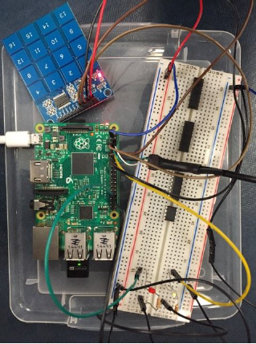
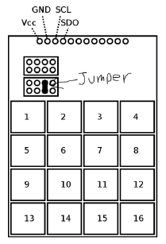
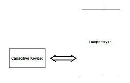

## TTP229 Capacitive Keypad

Developers: Randy Dang & Kevin Liang

### Introduction
This project involves the exploration of the TTP229 Capacitive Keypad with the Raspberry Pi Interface. There is another version of this device that uses the I2C interface, this specific one does not. This specific TTP229 keypad simply uses the Raspberry Pi’s interface and built in GPIO pins

### Overview
The TTP229 keypad is powered with a voltage range of 2.4V ~ 5.5V. In the case of this demonstration, it will be powered with 3.3V from the Raspberry Pi itself.
The keypad provides the user with 2 different modes on input, the 8-key mode and 16-key mode. The 8 output pins are functionally related to the 8 keys of 8 key mode. In order to access and use 16-key mode, a jumper is needed to read all 16 keys. Without the jumper, only 8 keys can be read.

The TTP229 keypad can be used as both an input device and output device. In the case of this project, we are using the keypad as an input device, reading the 16 different keys and providing the user with clear distinction between them. The keypad has 12 pins with the first 4 being VCC, GND, SCL (Serial Clock In), and SDO (Serial Data Out). The other 8 pins are used solely for output. For input, only the first four pins on the keypad need to be connected,
while the output pins can stay as they are. The pins are connected to the Raspberry Pi as follows:

Keypad | Raspberry Pi
--- | --- 
Vcc | 3.3V
GND | GND
SCL | GPIO 17 (Or any other available one)
SDO | GPIO 14 (Or any other available one)

To demonstrate the operation of the keypad, the code provided below simply prompts the user to press different buttons (1-16 in 16 key mode) which will provide the user with different outputs.

### Issues 

**Challenge**: Not reading the key that was pressed, but rather a different key

**Challenge**: Not reading any key at all

**Challenge**: Sporadic burst of different keys upon pressing a key or not pressing any key at all 

**Challenge**: Timing of the clock cycle to properly read the keys

**Solution**: The three challenges above are all caused and solved in the same way. In all three cases, the buttons we pressed did not correlate with the output that was given on the console. There were some times where it did read the right character, but would then either keep reading that same character on pressing a different key, or it would randomly read and output keys that were never pressed. For example, if we were to hit 1 on the keypad, it would read 1, but then read 16, 3, 4, 2, 3, 1, 6, 2 and so on with different readings. At first, we thought that this problem occurred because of the incompatibility between the keypad and the Raspberry Pi, due to the fact that there were no resources online that used the keypad with a Raspberry Pi. After playing around with it a little more we realized that the issue was more of a hardware situation rather than the compatibility between the Pi and the keypad. We noticed that the circuit of the keypad is entirely exposed, figuring that this may have something to do with why it was reading values randomly. We were in fact right, as when we lifted the keypad off the flat surface of our table, it began to read values more consistently. The problem of it not reading any keys was solved but it was still reading and outputting random values. At that moment we have also noticed that our fingers were holding the keypad up by the edge of the buttons. This was the moment where we realized that the keypad was extremely sensitive, reading a keypad value when it was remotely touched. Upon researching more, we also noticed that many demonstrations using the keypad used some sort of guard such as a piece of styrofoam to hold the the keypad, and figured that this would be extremely important in reading accurate values. The last problem is still quite finicky, no matter the constant of the clock cycle we used there was no 100% accurate reading
of any keys. That is not to say that we do not have a functional circuit, rather it does not always take a correct input. For example, if we were pressing 1, sometimes the keypad would not read our input and would prompt us for another input. However, a feasible solution to that would be to extend the sleep timer to ensure you’re getting a long enough read on the key you are pressing.
